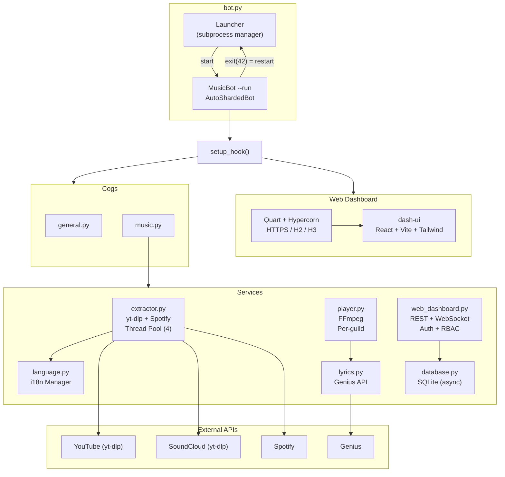
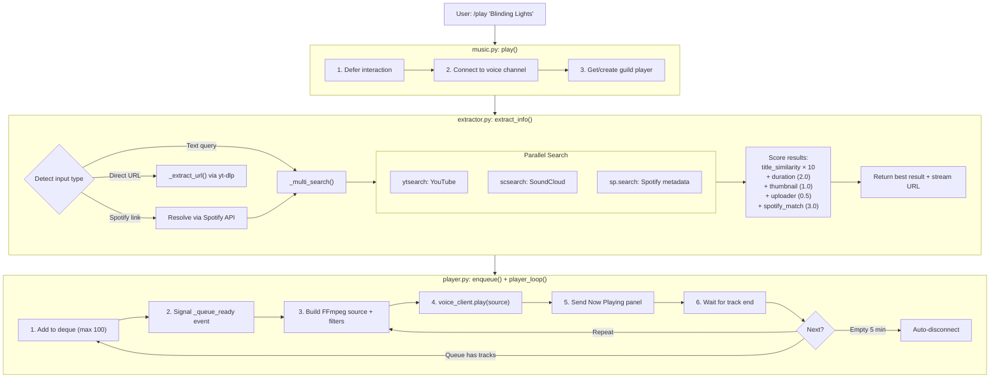

# 🎵 Discord Music Bot

[](https://python.org)
[](LICENSE)
[](https://github.com/Marton252/MusicBot/actions)
[](https://github.com/Marton252/MusicBot/security/code-scanning)
[](https://ghcr.io/marton252/musicbot)

A feature-rich, multi-server Discord music bot with real-time audio streaming, interactive player panels, audio filters, lyrics from Genius, multilingual support, a secure React web dashboard, and a built-in bug reporting system.

**Built with:** Python · discord.py · FFmpeg · yt-dlp · React · Vite · Tailwind CSS · Quart · Hypercorn

---

## ✨ Highlights

- **Multi-Platform Search** — Parallel search across YouTube + SoundCloud with Spotify metadata scoring
- **Interactive Player Panel** — Rich embeds with 10 button/dropdown controls
- **Audio Filters** — Bassboost, Nightcore, Vaporwave applied mid-track with seek preservation
- **Genius Lyrics** — Search or auto-detect from the current track
- **Multilingual** — English & Hungarian, per-server, with Discord-native command translations
- **React Dashboard** — Glassmorphic dark UI with live WebSocket stats, log streaming, and remote restart
- **Multi-User RBAC** — Role-based dashboard access with admin, restart, and log permissions
- **HTTP/2 + HTTP/3 (QUIC)** — Modern protocol support via Hypercorn + aioquic
- **Persistent Buttons** — Report and control buttons survive bot restarts
- **Auto-Sharding** — `AutoShardedBot` for scaling past 1000+ servers
- **Auto Cleanup** — Transient feedback messages auto-deleted to keep chat clean

---

## 🚀 Quick Start

### Prerequisites

| Tool    | Version                  |
| ------- | ------------------------ |
| Python  | 3.11+                    |
| Node.js | 18+ (for dashboard)      |
| FFmpeg  | Latest (must be on PATH) |

### 1. Clone & Install

```bash
git clone https://github.com/Marton252/MusicBot.git
cd MusicBot

# Create virtual environment
python -m venv .venv
# Windows:
.venv\Scripts\activate
# Linux/macOS:
source .venv/bin/activate

pip install -r requirements.txt
```

### 2. Configure Environment

```bash
cp .env.example .env
# Edit .env with your tokens and settings
```

Required variables:

- `DISCORD_TOKEN` — from [Discord Developer Portal](https://discord.com/developers/applications)
- `DASHBOARD_ADMIN_PASSWORD` — a strong unique password (weak defaults are auto-rejected)

Optional (but recommended):

- `SPOTIFY_CLIENT_ID` / `SPOTIFY_CLIENT_SECRET` — enables Spotify link resolution & search scoring
- `GENIUS_ACCESS_TOKEN` — enables `/lyrics` command and button
- `OWNER_ID` — your Discord user ID for receiving bug reports
- `REPORT_CHANNEL_ID` — dedicated channel for bug reports
- `DASHBOARD_SECRET_KEY` — persists dashboard sessions across restarts

### 3. Build the Dashboard UI

```bash
cd dash-ui
npm install
npm run build
cd ..
```

### 4. Run

```bash
python bot.py
```

The launcher manages the bot as a subprocess and handles restarts automatically.
SSL certificates are **auto-generated** on first run if not already present.

---

## 🏗️ Architecture

### System Overview



### File Map

```
Musicbot/
├── bot.py                  # Entry point: Launcher (subprocess) + MusicBot class
├── config.py               # All .env variable parsing & validation
│
├── cogs/                   # Discord command modules (Cogs)
│   ├── general.py          # /ping, /help, /language, /report, /setup_report
│   │                       #   HelpView (persistent refresh + report buttons)
│   │                       #   ReportModal, ReportView (persistent report panel)
│   │
│   └── music.py            # /play, /skip, /stop, /queue, /nowplaying, /filters, /lyrics
│                           #   MusicControlView (10-button NP panel)
│                           #   VolumeSelect, FilterSelect (dropdown menus)
│                           #   PersistentMusicReportView
│                           #   _schedule_delete (auto-cleanup helper)
│                           #   _build_np_embed, _build_queue_embed (embed builders)
│
├── services/               # Core business logic
│   ├── __init__.py
│   ├── extractor.py        # Multi-platform search engine
│   │                       #   YTDLSource: parallel YT+SC search, Spotify resolve
│   │                       #   Scoring system: title similarity + metadata matching
│   │                       #   Thread pool (4 workers) for yt-dlp blocking calls
│   │                       #   Spotify track/playlist/album resolution via spotipy
│   │
│   ├── player.py           # Per-guild audio player
│   │                       #   MusicPlayer: event-driven queue (asyncio.Event)
│   │                       #   FFmpeg PCMVolumeTransformer with filter support
│   │                       #   Seek preservation on filter change
│   │                       #   Stream URL refresh for non-YouTube on filter restart
│   │                       #   PlayerManager: guild → player registry
│   │
│   ├── language.py         # Internationalization (i18n)
│   │                       #   LanguageManager: locale file loading + string lookup
│   │                       #   CommandTranslator: Discord locale → app command translation
│   │
│   ├── lyrics.py           # Genius API integration
│   │                       #   Thread pool (2 workers) for blocking HTTP calls
│   │
│   ├── database.py         # Async SQLite via aiosqlite
│   │                       #   Guild language settings (with in-memory cache)
│   │                       #   Dashboard user CRUD (multi-user RBAC)
│   │                       #   Auto-detects Docker for database path
│   │
│   └── web_dashboard.py    # Quart HTTPS server
│                           #   Auto-generates self-signed SSL certs on first run
│                           #   HMAC-signed stateless session cookies
│                           #   Rate-limited login (5 attempts/60s)
│                           #   WebSocket: live stats (1s interval) + log streaming
│                           #   User management API (admin only)
│                           #   Fernet-encrypted password storage for admin viewing
│                           #   CSP headers (Cloudflare-compatible)
│
├── locales/                # Translation files
│   ├── en.json             # English (98 keys)
│   └── hu.json             # Hungarian (98 keys)
│
├── dash-ui/                # React + Vite + Tailwind CSS v4 frontend
│   └── dist/               # Production build (served by Quart)
│
├── .github/                # GitHub automation
│   ├── dependabot.yml      # Grouped dependency updates (pip, npm, actions, docker)
│   ├── labeler.yml         # Auto-label PRs by changed file paths
│   └── workflows/
│       ├── ci.yml              # Lint (Python + ESLint), secret scan (Gitleaks), Docker build test
│       ├── docker-publish.yml  # Build & push image to GHCR on release
│       ├── ai-issue-summary.yml  # AI-powered issue summarization
│       ├── greetings.yml       # Welcome first-time contributors
│       └── labeler.yml         # PR auto-labeling trigger
│
├── .env                    # Environment configuration (not committed)
├── .env.example            # Template with all available settings
├── .python-version         # Python version pin (3.12)
├── .gitignore              # Git ignore rules
├── .dockerignore           # Docker build context exclusions
├── requirements.txt        # Python dependencies
├── Dockerfile              # Multi-stage container build (Node + Python)
├── docker-compose.example.yml  # Docker Compose template (no clone needed)
├── docker-compose.yml      # Docker Compose orchestration (not committed)
├── generate_cert.py        # Self-signed certificate generator
├── LICENSE                 # MIT License
└── database.db             # SQLite database (auto-created)
```

### Data Flow: Playing a Song



### Message Lifecycle

The bot uses two auto-deletion strategies to keep chat clean:

| Context                                   | Method                                                                    | Why                                                           |
| ----------------------------------------- | ------------------------------------------------------------------------- | ------------------------------------------------------------- |
| **Public messages** (slash commands)      | `_schedule_delete()` — asyncio task that calls `msg.delete()` after delay | `delete_after` param is unreliable on interaction responses   |
| **Ephemeral messages** (button callbacks) | `delete_after=N` parameter                                                | Discord handles client-side, bot cannot API-delete ephemerals |

| Message Type                          | Delete After | Strategy                                  |
| ------------------------------------- | ------------ | ----------------------------------------- |
| `/play` feedback ("Now Playing: X")   | 10s          | `_schedule_delete`                        |
| `/skip`, `/stop`, `/filters` feedback | 10s          | `_schedule_delete`                        |
| `/ping`, `/language` feedback         | 10s          | `_schedule_delete`                        |
| `/queue` embed                        | 30s          | `_schedule_delete`                        |
| Playlist import status                | 10s          | `_schedule_delete`                        |
| Button: Skip, Shuffle, Volume, Filter | 10s          | `delete_after` (ephemeral)                |
| Button: Queue embed                   | 30s          | `delete_after` (ephemeral)                |
| Button: Volume/Filter picker          | 30s          | `delete_after` (ephemeral)                |
| Now Playing panel                     | ♾️           | Persists (deleted when next song starts)  |
| Lyrics                                | ♾️           | Persists (ephemeral, only requester sees) |
| Help embed                            | ♾️           | Persists                                  |
| Report modal response                 | ♾️           | Persists (ephemeral confirmation)         |

### Key Design Decisions

- **Launcher + subprocess model** — `bot.py` runs a thin loop; the bot runs as `bot.py --run`. Exit code `42` triggers automatic restart from the dashboard.
- **Event-driven player loop** — No spin-loops; uses `asyncio.Event` to wait for queue items efficiently. Zero CPU when idle.
- **Dedicated thread pools** — yt-dlp (4 workers) and Genius (2 workers) run in separate `ThreadPoolExecutor`s to prevent blocking the async event loop.
- **Multi-platform parallel search** — YouTube and SoundCloud are searched simultaneously via `asyncio.gather`. Spotify metadata is used for result scoring, not playback.
- **Stream URL refresh** — Non-YouTube platforms (SoundCloud etc.) have fast-expiring stream URLs. On filter restart, the bot re-extracts a fresh URL from `webpage_url`.
- **Modular Cogs** — Commands organized into `cogs/music.py` and `cogs/general.py`, loaded alphabetically.
- **Async SQLite** (`aiosqlite`) — Persistent database for guild settings and dashboard users with in-memory language caching.
- **YouTube cookie support** — Browser cookie extraction (`COOKIES_FROM_BROWSER`) or `cookies.txt` file to bypass bot detection.
- **Self-signed SSL** — `generate_cert.py` included for local HTTPS setup.
- **Graceful shutdown** — Database flushed, voice clients disconnected, FFmpeg processes cleaned up on exit.

---

## 🎵 Music Playback

Stream audio from **YouTube**, **Spotify**, and **SoundCloud** — search by name or paste a URL.

### Slash Commands

| Command             | Description                                   | Permission    |
| ------------------- | --------------------------------------------- | ------------- |
| `/play <query>`     | Play a song or add to queue (URL or search)   | Everyone      |
| `/skip`             | Skip the current track                        | Everyone      |
| `/stop`             | Stop playback, clear queue, disconnect        | Everyone      |
| `/queue`            | Show the next 10 tracks in queue              | Everyone      |
| `/nowplaying`       | Show the interactive player panel             | Everyone      |
| `/lyrics [query]`   | Show lyrics (auto-detects from current track) | Everyone      |
| `/filters <filter>` | Apply audio filter (requires active playback) | Everyone      |
| `/help`             | Show the full help menu with bot stats        | Everyone      |
| `/ping`             | Show bot latency                              | Everyone      |
| `/report`           | Submit a bug report to developers             | Everyone      |
| `/language <lang>`  | Set server language (English / Magyar)        | Manage Server |
| `/setup_report`     | Deploy a persistent report button panel       | Administrator |

### Playback Details

- **Multi-platform search**: text queries search YouTube + SoundCloud in parallel, scored with Spotify metadata for best results.
- **Spotify support**: track links resolved via API → searched on YT/SC. Playlist and album links import up to 50 tracks (batch-resolved, 5 at a time).
- **Auto-disconnect**: 5 minutes of inactivity.
- **Queue capacity**: 100 tracks per server.
- **Auto-reconnect**: FFmpeg streaming with `-reconnect` flags.
- **Filter persistence**: Filters are applied mid-track with seek preservation — no playback interruption.

---

## 🎛️ Interactive Player Panel

When a song starts playing, the bot sends a rich embed with an interactive button panel:

### Embed Info

- **Song title** (linked to original URL)
- **Artist**, **Duration** (mm:ss or h:mm:ss), **Platform** (YouTube/SoundCloud)
- **Status** (Playing / Paused)
- **Thumbnail** from the source platform
- **Footer** with control permissions note + timestamp

### Button Controls (Row 1)

| Button               | Function                                     |
| -------------------- | -------------------------------------------- |
| ⏸️ Pause / ▶️ Resume | Toggle playback (updates embed live)         |
| ⏭️ Skip              | Skip to the next track                       |
| 🟥 Stop              | Stop playback, disable buttons, disconnect   |
| 📋 Queue             | Show the queue (ephemeral, auto-deletes 30s) |
| 🔀 Shuffle           | Randomize the queue order                    |

### Button Controls (Row 2)

| Button    | Function                                               |
| --------- | ------------------------------------------------------ |
| 🔊 Volume | Dropdown: 10%, 25%, 50%, 75%, 100%, 125%, 150%         |
| 🔁 Repeat | Toggle repeat for current track (button color changes) |
| 🎛️ Filter | Dropdown: None, Bassboost, Nightcore, Vaporwave        |
| 📜 Lyrics | Fetch from Genius (ephemeral, multi-page if long)      |
| ⚠️ Report | Open bug report modal                                  |

### Permission System

| Who                            | Can Control                |
| ------------------------------ | -------------------------- |
| Server admins (`manage_guild`) | ✅ All controls            |
| Members with a `DJ` role       | ✅ All controls            |
| The user who queued the track  | ✅ All controls            |
| Everyone else                  | Queue, Lyrics, Report only |

---

## 🎚️ Audio Filters

Apply real-time FFmpeg audio effects to the current playback session.

| Filter        | Effect                         | FFmpeg Flag                           |
| ------------- | ------------------------------ | ------------------------------------- |
| **Bassboost** | Heavy low-frequency boost      | `bass=g=20`                           |
| **Nightcore** | Speed up + pitch raise (1.25×) | `aresample=48000,asetrate=48000*1.25` |
| **Vaporwave** | Slow down + pitch lower (0.8×) | `aresample=48000,asetrate=48000*0.8`  |
| **None**      | Revert to unaltered audio      | `-vn`                                 |

When applied mid-track, the bot calculates elapsed time (accounting for pause/resume) and seeks to the correct position. For non-YouTube platforms, a fresh stream URL is re-extracted to avoid expired links.

---

## 📜 Lyrics (Genius)

- Powered by the **Genius API** (requires `GENIUS_ACCESS_TOKEN` in `.env`).
- Available via `/lyrics [query]` command or the 📜 button on the player panel.
- Uses the current track if no query is given.
- **Smart title cleaning**: strips `(Official Video)`, `[Audio]`, VEVO suffixes, and topic channels for accurate Genius matches.
- Long lyrics are automatically **split across multiple embeds** (max 4096 chars each).
- Displayed as ephemeral messages (only visible to the requester).

---

## 🌍 Multilingual Support

- Currently supported: **English** and **Hungarian (Magyar)**.
- Set per-server via `/language <lang>` (requires Manage Server permission).
- Language preference stored in the database — persists across restarts.
- All 98 locale keys fully translated: button labels, embed fields, error messages, help text.
- Discord's native command translation: slash command names and descriptions auto-translate based on each user's Discord client language.

---

## 🛠️ Reporting System

- Reports are packaged as rich embeds with user info, server info, and the problem description.
- Delivered to the bot owner's DMs, or to a dedicated `REPORT_CHANNEL_ID` if configured.
- Use `/report` or the ⚠️ button on the player panel.
- `/setup_report` deploys a persistent "Report Problem" button panel into a channel (survives bot restarts).

---

## 📊 Web Dashboard

Access at `https://<your-ip>:25825` after starting the bot (port configurable via `DASHBOARD_PORT` in `.env`).

### Live Telemetry

- **Uptime**, **Ping**, **Guilds**, **Users**, **Voice Clients**, **RAM**, **CPU** — updated every second via WebSocket.
- Three performance graphs with rolling history and animated bars.
- Stats history preserved server-side (up to 24h) — survives page refresh.

### Live Logs

- Bot event logs streamed in real-time — filterable by INFO, WARNING, and ERROR levels.
- Color-coded severity. 500-line ring buffer.

### Multi-User Access Control

| Permission          | Admin | Regular User     |
| ------------------- | ----- | ---------------- |
| View stats & graphs | ✅    | ✅               |
| View live logs      | ✅    | Per-user setting |
| Restart bot         | ✅    | Per-user setting |
| Manage users        | ✅    | ❌               |

- Admin account defined via `DASHBOARD_ADMIN_USER` / `DASHBOARD_ADMIN_PASSWORD` in `.env`.
- Additional users created via the dashboard UI with per-user permissions.

### Security

- HMAC-signed session cookies (30-day validity, `HttpOnly`, `Secure`, `SameSite=Strict`).
- bcrypt password hashing (cost factor 12).
- Login rate limiting (5 attempts per 60 seconds per IP).
- Insecure default passwords are automatically rejected.
- Fernet-encrypted password storage for admin viewing.
- CSP headers (Cloudflare-compatible).
- Stateless sessions — no server-side session store.

**Tech Stack:** React + Vite + Tailwind CSS v4 + Framer Motion (frontend), Quart + Hypercorn (backend)

---

## 🐳 Docker

### Quick Start (Recommended)

Pull the pre-built image from GitHub Container Registry — **no cloning required**:

```bash
# 1. Create a directory and download the config files
mkdir musicbot && cd musicbot
curl -O https://raw.githubusercontent.com/Marton252/MusicBot/main/.env.example
curl -O https://raw.githubusercontent.com/Marton252/MusicBot/main/docker-compose.example.yml

# 2. Configure
cp .env.example .env
cp docker-compose.example.yml docker-compose.yml
# Edit .env — set at minimum: DISCORD_TOKEN and DASHBOARD_ADMIN_PASSWORD

# 3. Run
docker compose up -d
```

> **Note:** All config lives in `.env` — no Docker-specific overrides needed.
> The bot defaults to `DASHBOARD_BIND=0.0.0.0` and auto-detects the Docker database path.

The dashboard is available at `https://<your-server-ip>:25825`.
SSL certificates are **auto-generated** on first boot.

### Docker Compose Configuration

The `docker-compose.example.yml` uses the pre-built image:

```yaml
services:
  bot:
    image: ghcr.io/marton252/musicbot:latest
    container_name: discord-musicbot
    restart: unless-stopped
    env_file:
      - .env
    environment:
      - TZ=${BOT_TIMEZONE:-UTC}
    ports:
      - "${DASHBOARD_PORT:-25825}:${DASHBOARD_PORT:-25825}"
    volumes:
      - bot-data:/app/data
      # - ./certs:/app/certs:ro              # Optional: custom TLS certs
      # - ./cookies.txt:/app/cookies.txt:ro  # Optional: YouTube cookies

volumes:
  bot-data:
```

### Manual Docker Run

If you prefer not to use Docker Compose:

```bash
# 1. Download and configure .env (see Quick Start above)

# 2. Run
docker run -d \
  --name discord-musicbot \
  --env-file .env \
  -p 25825:25825 \
  -v musicbot-data:/app/data \
  --restart unless-stopped \
  ghcr.io/marton252/musicbot:latest
```

### Build from Source

If you prefer to build the image locally instead of pulling the pre-built one:

```bash
git clone https://github.com/Marton252/MusicBot.git
cd MusicBot
cp .env.example .env
# Edit .env with your tokens

# Using Docker Compose
docker compose up -d --build

# Or manually
docker build -t discord-musicbot .
docker run -d --env-file .env -p 25825:25825 -v musicbot-data:/app/data discord-musicbot
```

### Available Tags

| Tag      | Description                   |
| -------- | ----------------------------- |
| `latest` | Most recent stable release    |
| `1.0.0`  | Specific version              |
| `1.0`    | Latest patch of minor version |
| `1`      | Latest minor of major version |

### Useful Commands

```bash
docker compose logs -f                       # Follow live logs
docker compose restart                       # Restart the bot
docker compose pull && docker compose up -d  # Update to latest version
docker compose down                          # Stop and remove container
docker compose exec bot python -c "print('ok')"  # Test container health
```

---

## 📄 License

This project is licensed under the [MIT License](LICENSE).
