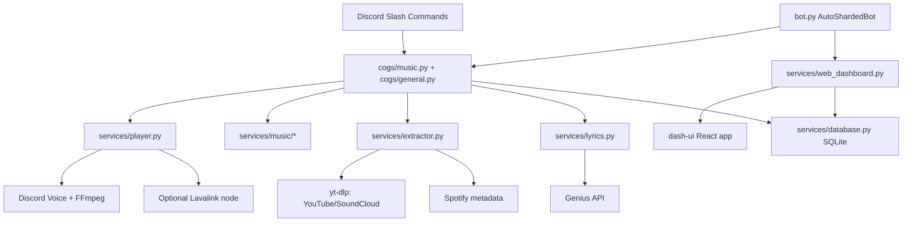

# Discord Music Bot

[](https://python.org)
[](LICENSE)
[](https://github.com/Marton252/MusicBot/actions/workflows/ci.yml)
[](https://github.com/Marton252/MusicBot/security/code-scanning)
[](https://ghcr.io/marton252/musicbot)

A modern Discord music bot with slash commands, interactive player controls, saved queues, audio filters, Genius lyrics, multilingual support, and a React dashboard.

**Stack:** Python 3.12 · discord.py · Lavalink/Wavelink · FFmpeg fallback · yt-dlp · SQLite · Quart · Hypercorn · React · Vite · Tailwind CSS · Docker

## Features

- **Slash-command music controls** with both classic commands and the newer `/music ...` command group.
- **Interactive now-playing panel** with pause/resume, skip, stop, queue, shuffle, repeat, volume, filters, lyrics, and report controls.
- **YouTube, SoundCloud, and Spotify support** using yt-dlp extraction plus Spotify metadata resolution.
- **Audio filters**: `bassboost`, `nightcore`, `vaporwave`, `karaoke`, and `8d`.
- **Lavalink audio backend by default** for a separate audio node, better buffering, filter support, and future crossfade work.
- **Saved queues** with `/music save`, `/music load`, and `/music saved`.
- **Dashboard** with live stats, logs, restart controls, and role-based user management.
- **Localization** for English and Hungarian server settings.
- **Production automation** through CI, CodeQL, Gitleaks, Dependabot, Docker build checks, and GHCR releases.

## Quick Start

### Requirements

| Tool | Version |
| --- | --- |
| Python | 3.12+ |
| Node.js | 22 recommended |
| FFmpeg | Installed and available on `PATH` |

### Local Development

```bash
git clone https://github.com/Marton252/MusicBot.git
cd MusicBot

python -m venv .venv

# Windows
.venv\Scripts\activate

# Linux/macOS
source .venv/bin/activate

pip install -r requirements.txt
cp .env.example .env
```

Edit `.env` and set at least:

```env
DISCORD_TOKEN=your_discord_bot_token
CLIENT_ID=your_discord_application_client_id
DASHBOARD_ADMIN_PASSWORD=change_this_to_a_strong_password
```

Build the dashboard once:

```bash
cd dash-ui
npm ci
npm run build
cd ..
```

Run the bot:

```bash
python bot.py
```

The dashboard is served at `https://localhost:25825` by default. Self-signed TLS certificates are generated automatically on first run.

### Docker

Use the published image from GitHub Container Registry:

```bash
mkdir musicbot && cd musicbot
curl -O https://raw.githubusercontent.com/Marton252/MusicBot/main/.env.example
curl -O https://raw.githubusercontent.com/Marton252/MusicBot/main/docker-compose.example.yml

cp .env.example .env
cp docker-compose.example.yml docker-compose.yml

# Edit .env, then start:
docker compose up -d
```

The compose file starts both the bot and the internal Lavalink node, uses `ghcr.io/marton252/musicbot:latest`, persists SQLite data in a Docker volume, and exposes `${DASHBOARD_PORT:-25825}`.

## Commands

### Music Group

| Command | What it does |
| --- | --- |
| `/music play <query>` | Plays a URL/search query or adds it to the queue. Includes autocomplete. |
| `/music skip` | Skips the current track. |
| `/music stop` | Stops playback, clears the queue, and disconnects. |
| `/music nowplaying` | Shows or refreshes the player panel. |
| `/music queue view` | Shows the queue. |
| `/music queue clear` | Clears queued tracks. |
| `/music queue remove <index>` | Removes one queue item. |
| `/music queue move <index> <target>` | Moves one queue item. |
| `/music filter <filter>` | Applies `none`, `bassboost`, `nightcore`, `vaporwave`, `karaoke`, or `8d`. |
| `/music save <name>` | Saves the current queue for this server. |
| `/music load <name>` | Loads a saved queue. |
| `/music saved` | Lists saved queues. |

### General Commands

| Command | Permission | What it does |
| --- | --- | --- |
| `/help` | Everyone | Shows the help panel. |
| `/ping` | Everyone | Shows bot latency. |
| `/lyrics [query]` | Everyone | Shows lyrics for the current track or a search query. |
| `/report` | Everyone | Opens a bug report modal. |
| `/language <English/Magyar>` | Manage Server | Sets the server language. |
| `/setup_report` | Administrator | Sends a persistent report button panel. |

Legacy flat music commands such as `/play`, `/skip`, `/stop`, `/queue`, `/nowplaying`, and `/filters` are still available for compatibility.

## Dashboard

The dashboard is a React/Vite frontend served by the Quart backend.

| Area | Capabilities |
| --- | --- |
| Live stats | Uptime, ping, guilds, users, voice clients, RAM, CPU, and rolling history. |
| Logs | Real-time log stream with severity filtering. |
| Controls | Restart endpoint and operational actions for permitted users. |
| Users | Admin-managed dashboard accounts with per-user permissions. |
| Security | Signed cookies, bcrypt password hashes, login rate limiting, trusted-proxy handling, and CSP headers. |

Important dashboard environment variables:

| Variable | Purpose |
| --- | --- |
| `DASHBOARD_PORT` | Dashboard port, default `25825`. |
| `DASHBOARD_BIND` | Bind address, default `0.0.0.0`. Use `127.0.0.1` for local-only access. |
| `DASHBOARD_ADMIN_USER` | Initial admin username. |
| `DASHBOARD_ADMIN_PASSWORD` | Initial admin password. Weak defaults are rejected. |
| `DASHBOARD_SECRET_KEY` | Keeps sessions and encrypted dashboard data stable across restarts. |
| `TRUSTED_PROXY_IPS` | Enables trusted `X-Forwarded-For` / Cloudflare IP handling only for configured proxies. |

See [.env.example](.env.example) for the complete configuration template.

Optional audio backend variables:

| Variable | Purpose |
| --- | --- |
| `MUSIC_BACKEND` | `lavalink` by default; use `ffmpeg` for the built-in fallback or `auto` for best-effort fallback. |
| `LAVALINK_HOST` / `LAVALINK_PORT` | Lavalink node address, default `lavalink:2333` for Docker Compose. |
| `LAVALINK_PASSWORD` | Shared password for the bot and Lavalink node. |
| `LAVALINK_SECURE` | Enables HTTPS/WSS connections to external Lavalink nodes. |
| `LAVALINK_CONNECT_RETRIES` | Startup connection attempts for compose/node warm-up. |
| `LAVALINK_CONNECT_RETRY_DELAY` | Delay between Lavalink startup connection attempts. |
| `LAVALINK_CROSSFADE_SECONDS` | Reserved for future true crossfade; keep `0` for now. |

If the node is still warming up after startup, the bot keeps retrying in the background. Set `MUSIC_BACKEND=ffmpeg` if you want to run without Lavalink.

## Architecture



Core implementation notes live in [AGENTS.md](AGENTS.md). The key boundaries are:

- `cogs/` owns Discord command and interaction behavior.
- `services/player.py` owns voice playback lifecycle and FFmpeg source handling.
- `services/music/` owns queue, playback state, filters, policies, UI helpers, and session facades.
- `services/web_dashboard.py` owns the dashboard API, auth, WebSocket stats, and logs.
- `services/database.py` owns persistent guild settings, dashboard users, and saved queues.

## Testing

The CI workflow runs secret scanning, Python checks, unit tests, dashboard lint/build, and a Docker build dry run.

Run backend checks locally:

```bash
python -m py_compile bot.py config.py generate_cert.py
python -m compileall cogs/ services/ tests/ -q
python -m unittest discover -s tests -v
```

Run dashboard checks locally:

```bash
cd dash-ui
npm ci
npm run lint
npm run build
```

See [TESTING.md](TESTING.md) for test coverage notes and conventions.

## Releases And Docker Tags

Release tags trigger the Docker publish workflow and push images to GHCR.

| Tag | Meaning |
| --- | --- |
| `latest` | Most recent stable image. |
| `1.0.4` | Exact release version. |
| `1.0` | Latest patch in the `1.0` line. |
| `1` | Latest release in major version `1`. |

Useful Docker commands:

```bash
docker compose logs -f
docker compose restart
docker compose pull && docker compose up -d
docker compose down
```

## Links

- [GitHub Actions](https://github.com/Marton252/MusicBot/actions)
- [Container Registry](https://ghcr.io/marton252/musicbot)
- [Configuration template](.env.example)
- [Testing guide](TESTING.md)
- [Agent/developer notes](AGENTS.md)

## License

This project is licensed under the [MIT License](LICENSE).
